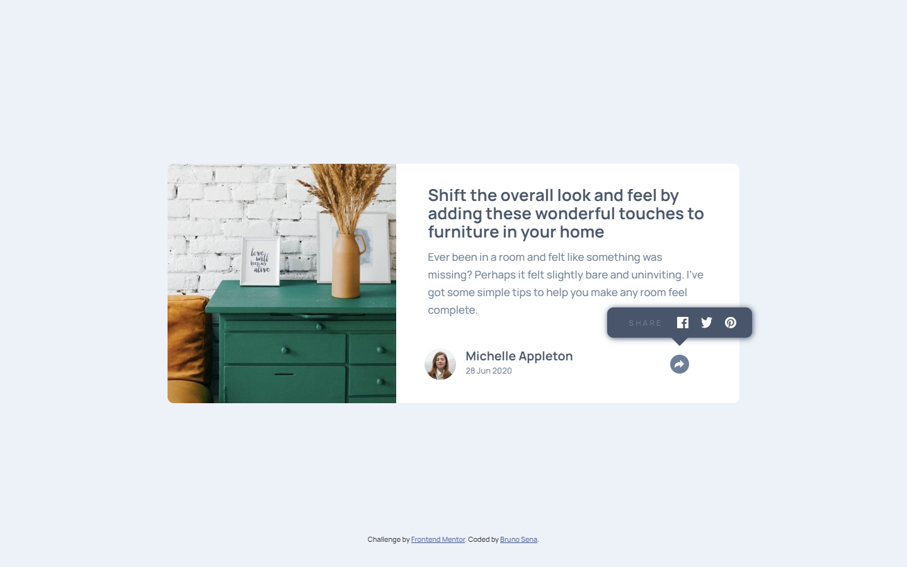

# Frontend Mentor - Article preview component solution

This is a solution to the [Article preview component challenge on Frontend Mentor](https://www.frontendmentor.io/challenges/article-preview-component-dYBN_pYFT). Frontend Mentor challenges help you improve your coding skills by building realistic projects.

## Table of contents

- [Overview](#overview)
  - [The challenge](#the-challenge)
  - [Screenshot](#screenshot)
  - [Links](#links)
- [My process](#my-process)
  - [Built with](#built-with)
  - [What I learned](#what-i-learned)
- [Author](#author)

## Overview

### The challenge

Users should be able to:

- View the optimal layout for the component depending on their device's screen size
- See the social media share links when they click the share icon

### Screenshot



### Links

- Solution URL: [GitHub](https://your-solution-url.com)
- Live Site URL: [Netlify](https://your-live-site-url.com)

## My process

### Built with

- Semantic HTML5 markup
- CSS custom properties
- SASS
- Flexbox
- Mobile-first workflow

### What I learned

Lately I was focused on learning SASS so I decided to practice with this project. It is still a language that I don't know a lot about, but I liked the idea and the organization. I was able to keep pace and order in such a short time.

I love mixins. I feel the code lighter with the help of them:

```scss
@mixin mobile {
    @media (max-width: $mobile){
        @content;
    }
}
```

### Continued development

It was difficult to start the project with SASS, so at first I did not start with it, but as I saw errors in my code and the more heavy and unreadable the style sheets became, I decided to include SASS. I still have a lot to learn about this language, but I liked the result, although I know it can be improved.

## Author

- Frontend Mentor - [@brujavsen](https://www.frontendmentor.io/profile/brujavsen)